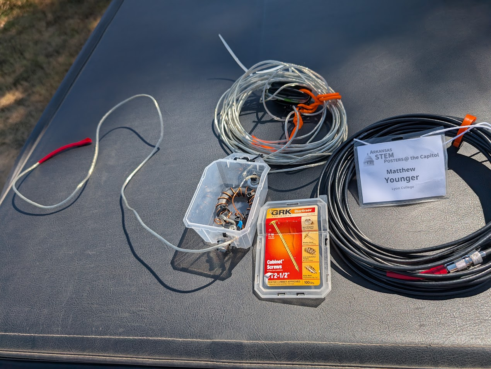

## Project Overview: The Heavy Hitter

This project was part of my continued exploration of [Digital Signal Processing](BoE.qmd) and [Morse Code](cw-data-sci.qmd). While these previous projects offered powerful insights into wireless theory and communications, I had the desire to step up to assembling a dedicated analog/digital hybrid radio from discrete components and confront the physical realities of radio frequency (RF) design.

I took on the build of a **QCX-mini 20m QRP CW Transceiver** (designed by QRP Labs) - this kit is a remarkably compact, 5-watt single-band Morse code transceiver featuring a Class-E power amplifier, an onboard synthesized VFO (Si5351A), and digital DSP-based filtering.

Recognizing that the dense layout and fine-pitch components can present a steep barrier for prospective builders, I documented the entire assembly journey as a multi-part, step-by-step video guide and postmortem for the amateur radio community.

Additionally, due to strict cost constraints at the time, I set out to build my own End-fed Half-wave antenna from commonly available materials (speaker wire, toroids and various parts from Amazon, and upcycled materials from around the house). Throughout building and assembling this antenna, I taught myself how to read a Smith charts on an inexpensive VNA in order to tune the antenna for resonance on the $20m$ band. 

Testing with this kit and my home-built antenna revealed that I could easily receive world-wide transmissions (verified with Web SDR as far as Denmark) and nearly make contact with stations in Hawaii in early 2026. Completing this project gave me tremendous insight into precision assembly of complex electronic systems, basic antenna theory, and now offers a very capable vehicle for real-world testing of ML algorithms for decoding hand-fisted CW communications. I also found wonderful community with the great folks at the [Long Island CW Club](https://longislandcwclub.org/), who I am very pleased to make their acquaintence and continue learning about CW as time permits.

---

## Video Guide & Build Postmortem

Rather than producing a polished, fast-forwarded montage, the series captures the build process: inspecting miniature solder joints, winding toroid transformers, avoiding common assembly traps, and walking through bench testing prerequisites.



*Complete Build Playlist:* [Watch the Full QCX-mini Build Series on YouTube](https://youtube.com/watch?v=wQ74Fb2kWv0&list=PLYMqW8m2xx7XMGyPr3m4tDiYvCoCZmM3b)

---

## Key Hardware & Assembly Challenges

The QCX-mini packs a full superheterodyne/direct-conversion receiver, transmitter, LCD screen, and microcontroller into an aluminum enclosure roughly the size of a deck of cards. Assembling it demanded laboratory-level precision and strict assembly discipline (learned on-the-fly and with whatever I had on hand at the time).

### 1. Toroid Winding & Enamel Stripping
RF inductors and impedance transformers require hand-winding enameled magnet wire around tiny ferrite/iron-powder toroid cores (such as T37-6 cores). 

* **Turns Accuracy:** Inductance scales quadratically with turns ($L \propto N^2$). A single missing or extra turn shifts the cutoff frequency of the multi-pole Chebyshev low-pass filter right into the passband. Ironically, the above thumbnail shows a major blunder - not spacing the windings evenly. For unknown reasons, this caused the output power to be far lower than 5W, which of course required desoldering and - in one case - rewinding with scrap wire.
* **Thermal Stripping:** The polyurethane enamel coating must be burned away or tinned cleanly before soldering into the high-density PCB. Every lead required continuity verification using a multimeter to ensure enamel remnants didn't insulate the solder joint. A Klein multimeter with beep continuity test was invaluable here, as it takes a lot more heat than one may think to melt off the coating.

### 2. Micro-Soldering in High-Density Layouts
Because through-hole pads sit mere fractions of a millimeter away from neighboring traces and pre-populated SMT components:

* I resolved to use a **jeweler's loupe / optical magnification** and ample lighting from a headlamp to inspect solder wetting, fillet geometry, and clearance on every joint. Happily, I had no major issues here, though the BNC connector was very difficult to secure with solder because it acted as a giant heat sink, preventing the solder from laying nicely and securing the mounting pegs to the PCB board.
* Maintained strict thermal control: applying targeted paste flux with a fine conical tip, dwelling for under two seconds to prevent lifting pads or heat-soaking sensitive transistors.
* Utilized precision flush-cutters to clip component leads sub-millimeter to prevent shorts against the metal casing.

### 3. RF Bench Safety & Load Termination
Unlike audio amplifiers, an RF transmitter cannot be tested open-circuit without instantly destroying the final output transistors (BS170 MOSFETs) due to reflected power and voltage standing waves (high VSWR). 
* Prepared a calibrated **50-ohm dummy load** capable of dissipating 5W continuous RF power.
* Validated receiver alignment, sideband suppression, and sidetone pitch prior to any antenna connection.

---

---

## Field Radiator: 20m End-Fed Half-Wave (EFHW) Antenna

A portable QRP transceiver is only as effective as the antenna system attached to it. Rather than using an inefficient compromise whip, I designed and fabricated a resonant **20-meter End-Fed Half-Wave (EFHW)** wire antenna paired with a custom broadband impedance matching transformer.

{#fig-efhw fig-align="center" width="80%"}

### Impedance Transformation & Transformer Physics

An end-fed half-wave radiator driven at resonance presents an extremely high feedpoint impedance, which the ARRL handbook reports to be between $2500\,\Omega$ and $3500\,\Omega$. This is due to the voltage antinode (and current node) at the wire's termination:

$$\lambda = \frac{c}{f} = \frac{3 \times 10^8\text{ m/s}}{14.060\text{ MHz}} \approx 21.34\text{ m} \implies \frac{\lambda}{2} \approx 10.67\text{ m}\ (35\text{ ft})$$

To match this high-impedance feed to the standard $50\,\Omega$ unbalanced output of the QCX-mini's BNC connector without a bulky antenna tuner, I hand-wound a **49:1 Unun (Unbalanced-to-Unbalanced) transformer**:

* **Toroid Selection:** Built on a high-permeability Fair-Rite **FT140-43** ferrite toroid core to maintain low insertion loss across the 14 MHz band while avoiding core saturation.
* **Winding Geometry:** Wound using an autotransformer configuration with an isolated primary coupling loop: 2 primary turns tapped into a 14-turn secondary ($N_p = 2$, $N_s = 14$).
* **Impedance Ratio:** Because transformation scales with the square of the turns ratio:
  $$\frac{Z_{\text{load}}}{Z_{\text{source}}} = \left(\frac{N_s}{N_p}\right)^2 = \left(\frac{14}{2}\right)^2 = 7^2 = 49 \implies 50\,\Omega \times 49 = 2450\,\Omega$$
* **High-Voltage Compensation Capacitor:** Placed a $100\text{ pF}$ / $1\text{ kV}$ silver-mica capacitor in parallel across the $50\,\Omega$ input to tune out leakage inductance introduced by the bifilar primary coupling at 14 MHz.

### Tuning & Vector Network Analysis

Tuning an EFHW requires meticulous length trimming to position the minimum Voltage Standing Wave Ratio (VSWR) directly inside the CW sub-band (14.000–14.070 MHz):

1. **Pruning the Radiator:** Began with roughly 36 feet of 22 AWG insulated stranded copper wire suspended in a sloper configuration.
2. **VNA Sweeps:** Used a calibrated NanoVNA to sweep the reflection coefficient ($S_{11}$) and return loss from 13.5 MHz to 14.5 MHz.
3. **Resonance Trimming:** Folded back the wire in 1-inch increments until the resonant dip achieved an $S_{11} < -25\text{ dB}$ (VSWR $< 1.15:1$) centered at **14.060 MHz** (the international QRP CW calling frequency).

This self-contained, resonant antenna requires no tuner and minimal counterpoise, providing a high-efficiency field radiator capable of working stations across North America on just 5 watts of RF power.

### What I Couldn't Resolve on My Own

Two questions came up during this build that I could work around in practice but never fully resolve in theory:

* **Core and wire sizing.** I settled on the FT140-43 core and 22 AWG wire based on what other builders' writeups used, not from a calculation I could reproduce myself. I don't yet know how to size a toroid core or wire gauge for a given power level from first principles—accounting for core saturation and heating at 5W of continuous RF, and how RF-specific effects like skin effect factor into an appropriate wire gauge—versus simply copying a known-good recipe.
* **The counterpoise question.** I found genuinely conflicting guidance in the amateur radio community about whether an EFHW like this needs a counterpoise (and if so, how long) or whether the feedline shield alone is sufficient. I still don't have a confident, first-principles answer to that question.

---

## Community Contribution: Technical Documentation

One of the main motivations for this project was giving back to the community. When I began, available build logs were often fragmented or skipped over tricky mechanical nuances—such as header clearance between daughterboards, rotary encoder alignment, and the installation sequence for the display sub-assembly.

By systematically logging each stage I've provided:

* **Tool Recommendations:** Clarified essential workbench tools (flush cutters, flux types, optical magnification, and multimeter continuity strategies) specifically tailored for amateur builders tackling high-density kits.
* **Failure Prevention:** Highlighted mechanical gotchas—like installing sub-boards out of sequence—that are difficult to undo once multi-pin headers are soldered.
* **Accessible Technical Explanations:** Broke down how analog and digital sub-circuits interface inside modern micro-transceivers.

---

## Where My Understanding Runs Out

The QCX-mini's own manual is thorough—schematic, theory of operation, and alignment procedure are all in there. But at my current level, I can follow the assembly instructions and get a working radio without being able to fully read the schematic diagrams the way a licensed RF engineer would. I can tell you *that* the receiver front-end, the DSP audio filter, and the transformer network work together—I can't yet tell you *why* each design choice was made, from first principles, the way the manual's author clearly can. That's the specific kind of knowledge I don't think I can keep self-teaching from a kit and a soldering iron alone—it's the kind of thing that comes from formal instruction by someone qualified to teach it.

---

## Relevance to Graduate Studies

Building and documenting this transceiver reinforced practical engineering competencies that directly connect to graduate-level research in **Electrical and Computer Engineering**:

* **RF Systems & Electromagnetics:** Built practical, hands-on familiarity with impedance matching, filter topology (Chebyshev low-pass networks), and harmonic suppression required for FCC compliance—largely through empirical trial-and-error rather than closed-form design, which is exactly the gap I'd want graduate coursework to close.
* **Hardware Troubleshooting & Diagnostics:** Practiced a rigorous, bottom-up diagnostic approach—isolating issues across power supplies, local oscillators, mixer stages, and final amplification—even where I couldn't always explain a failure from first principles.
* **Technical Communication:** The ability to document and explain complex electromechanical systems to diverse audiences is foundational to academic authorship, lab leadership, and peer collaboration.
* **Amateur Radio Credentialing:** Studying for and passing my **Amateur Extra Class FCC License (AI5YD)** gave me a working knowledge of electronics theory, though the license exam tests recall more than design capability—another reason I'm looking for more rigorous, formal instruction.